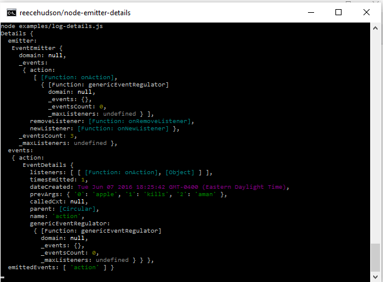

<!-- Since I cannot figure out how to put anchor links, I have replaced it with
     simply embolding the name of the header.  TODO use anchor links -->


Node Emitter Details
====================

Example
-------
```js
"use strict";

var util = require("util");
var getDetails = require("./");
var noop = function noop () {};
var put = function () {
  process.stdout.write.call(process.stdout, arguments[0]);
};

var e = new (require("events"))();
e.on("action", function onAction (){});
var d = getDetails(e, {excludedEvents: ["newListener", "removeListener"]});
e.emit("action", "apple", "kills", "aman");


put(util.inspect(d, {
      colors: true,
      depth: 4
    }));

```
Output:
<br/>
<br/>


API
---
When **exp** is:
```js
  var exp = require("./");
```
### `exp(eventEmitter, [opts])` ###
  * `eventEmitter`, any instance of `EventEmitter`

  * `opts` an options object where:

    * `excludedEvents`, is an array of events to disregard and not track

    * `saveInactiveEventDetails`, is a boolean indicating if it should keep
      the memory of an EventDetails whose events have all been removed
      (inactive)

  * returns an instance of `EmitterDetails`, see **Emitter Details** section.

### `exp.trackEvent(emitter, event)` ###

  * `emitter`, any instance of `Event Emitter`

  * `event`, string name of event

  * returns an instance of `EventDetails` (see **Event Details**) with the
    provided event registered to be tracked

### Details Objects ###

#### Emitter Details ####
* `emitter`
  * The event emitter being tracked.

* `events`
  * Any or none instances of `EventDetails`

* `emittedEvents`
  * Any or none strings of events that have emitted.

* `getEventNames()`
  * returns an array of event names being tracked

* `getEventDetails(eName)`
  * `eName`, event name as a string

  * returns the `EventDetails` (see **EventDetails**) of the event or `null`

#### Event Details ####
* `listeners`

  * Array of arrays containing pairs of listener to `HandlerDetails`.

* `timesEmitted`
  * Number of times emitted

* `dateCreated`
  * instance of `Date` when the listener was added

* `prevArgs`
  * Copy of `arguments` the listeners are supplied with.

* ~~`calledCxt`~~
  * ~~The context (`this`) of when `.emit()` was called~~
  * **Note:**  This method is disabled because of unreliability.  That is, it
    only works in non-strict mode.  I am currently deciding where I should take
    this.

*  `name`
  * String of the event name.

<!-- private internal
* `genericEventRegulator`
  * see **Generic Event Regulator** section -->

* `parent`
  * Pointer to `EmitterDetails` that created it.

* `getHandlerDetails(fn)`
  * `fn`, event handler
  * returns instance of `HandlerDetails` (see **Handler Details**) of the
    handler details object that matches the provided function or `null`.

* `getHandlers()`
  * returns all the handlers listening for the event

* `getHandlersDetails()`
  * returns all the handler details corresponding to the event

* `onUpdate(fn)`
  * `fn` callback, called next time there is an change of properties.  This
    happens when any of the events pertaining to the parent object are emitted.
    Event details instance is passed as the only arguments.

#### Handler Details ####
* `arity`
  * Length of function signature (parameters).

* `prevStackTrace`
  * String of stack trace of last time it was called

* `parent`
  * Pointer to `EventDetails` that it belongs to.
